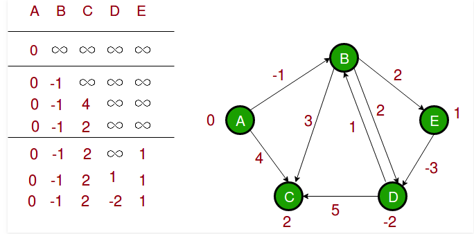

# Bellman–Ford Algorithm

```c++
#include <iostream>
#include "directed_graph.h"

using namespace std;

int main() {

    auto graph = new Graph();
    graph->add_node("0");
    graph->add_node("1");
    graph->add_node("2");
    graph->add_node("3");
    graph->add_node("4");

    graph->add_edge("0", "1", -1);
    graph->add_edge("0", "2", 4);
    graph->add_edge("1", "2", 3);
    graph->add_edge("1", "3", 2);
    graph->add_edge("1", "4", 2);
    graph->add_edge("3", "2", 5);
    graph->add_edge("3", "1", 1);
    graph->add_edge("4", "3", -3);

    std::vector<std::vector<std::string>> vec;
    cout << graph->bellman_ford("0",vec) << endl;
    
    for (auto const &x : vec) {
       cout << x[0] << " - " << x[1] << endl;
    }

    graph->print();

    delete graph;

    return 0;
}

```



```
0
0 - 0
1 - -1
2 - 2
3 - -2
4 - 1
0: 
	weight: -1 to: 1
	weight: 4 to: 2
1: 
	weight: 3 to: 2
	weight: 2 to: 3
	weight: 2 to: 4
2: 
3: 
	weight: 5 to: 2
	weight: 1 to: 1
4: 
	weight: -3 to: 3

```


